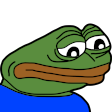

# React-Google-Map 🗺️🗺️🗺️

An isolated React component I extracted from a personal project.


I used [`React-Google-Maps-Wrapper`](https://www.npmjs.com/package/@googlemaps/react-wrapper) and [`react-autocomplete-places`](https://github.com/hibiken/react-places-autocomplete).

## Install

```
  git clone https://github.com/AbdelrhmanAmin/React-Google-Map.git
```

```
  npm i @googlemaps/react-wrapper react-places-autocomplete
```

## NOTES

- **I am currently occupied and I can't maintain or refactor this repo, so feel free to copy-paste and adjust the component to your own convenience.**

- **Unfortunately, I used Bootstrap to style this map. My deepest apologizes.** 

- **Get a free API from here: <https://developers.google.com/maps/documentation/maps-static/get-api-key#creating-api-keys>**

- **I am using dark map, you can get more styles from here: <https://mapstyle.withgoogle.com> . To change the style, just change the JSON file `MapStyle.json`**

## How to use? Here is an example

```JSX

import { Map } from "./MAP_FOLDER_NAME";

// Render pre-existing markers on the screen
const placesToGo = [
  { lat: 30.0444, lng: 31.2357, address: "Cairo"},
  { lat: 30.8761, lng: 29.7426, address: "Alexandria" },
]

<Map
  width={510}
  height={400}
  startAtCoords={{ lat: 30.033333, lng: 31.233334 }}
  placesToGo={placesToGo.current}
  // Get a free API from here: https://developers.google.com/maps/documentation/maps-static/get-api-key#creating-api-keys
  apiKey={"YOUR_API_KEY"}
/>

```
